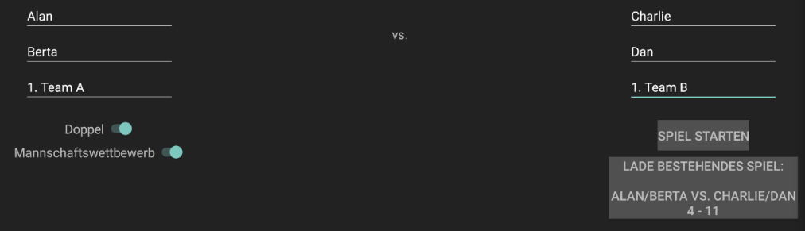

# BadmintonUmpireHelper
This Android app is designed to be used by badminton umpires to count a match on their phone or tablet.
It has a German and English language support.
Also, no internet connection is required, this application runs completely independent on the phone.

# WIP
This app is currently work in progress! Expect errors and failures.
Currently, the app is only manually tested, automated tests are planned for the near future.

# Screenshots (German Language)

## Main Screen

On the main screen one can select the type of game (single or double) as well as
the context (tournament or team game). Depending on the choice player names as well as
team names can be entered.
Also, old games can be loaded, e.g. if a game was interrupted.

## Selection Screen

On the selection screen one can perform the coin toss and then select sides as well as
the player who serves and accepts.

## Game Screens

During the game the umpire helper gives information about the status of the game (player, score, ...).
It also shows the correct announcements for the umpire.

